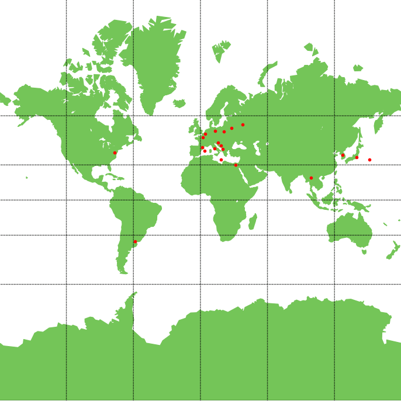

<h1 align="center">Analysis of Geoegraphic Coordinates</h1>

<p align="center">
  <a href="https://github.com/kamilkalarus">Kamil Kalarus</a>
</p>

## Description

The application is used to visualise a closed geometric figure on an interactive map, which is created by connecting all geographical points. This makes it possible to determine the actual perimeter of the created figure. 

Geographical data is imported from CSV files, allowing you to easily add locations and create complex shapes.Once imported, the data undergoes a meticulous verification for format compatibility. Once successfully verified, they are stored in a PostgreSQL database, ensuring their security and performance. The application then determines a closed geometric figure from the downloaded locations, plots it on a world map and calculates its actual perimeter.

## Table of contents
- [Functionality](#functionality)
- [Demo](#demo)
- [Requirements](#requirements)
  - [Operating System](#operating-system)
  - [Software versions](#software-versions)
  - [Python libraries](#python-libraries)
- [Setup](#setup)
  - [Using a ready-made .exe file (_relese_)](#using-a-ready-made-exe-file-relese)
  - [Manual (_develop_)](#manual-develop)
- [Input data set](#input-data-set)
  - [Data format requirements](#data-format-requirements)
  - [Example content of CSV data file](#example-content-of-csv-data-file)
- [Start-up method](#start-up-method)


## Functionality

- ***Import of CSV files*** - The application allows the user to upload a CSV file with geographical data and checks that the file is available and correctly indicated.

- ***Data verification*** - It performs a check of the data in the CSV file to ensure that it does not contain errors. If problems are detected, the application informs the user of the necessary corrections.

- ***Configuration file support*** - The application checks for the presence of a configuration file with database login data. If it is not present, it automatically creates it.

- ***Creation of a database*** - If the indicated database does not exist, the application creates a new database and the corresponding tables. Otherwise, it checks whether the tables are already created.

- ***Entry of data into the database*** - Only verified data is entered into the database. The application ensures that no duplicates occur.

- ***Extracting data from the database*** - The application takes data from the database and displays it on a world map, avoiding repeated points if their times or other values are identical.

- ***Drawing a geometric figure*** - The algorithm identifies the first three points and checks the possibility of forming a closed figure. For a larger number of points, the nearest point is added to the figure.

- ***Interactive display of algorithm activities*** - Each step of the algorithm is continuously displayed to the user, allowing them to observe the progress of the figure and the selection of the nearest point.

## Demo
The performance of the algorithm on 22 location points, two of which were merged due to identical geographical coordinates, is shown below.

  

## Requirements

The following requirements must be met in order to guarantee the correct functioning of the application. The application has not been tested on other configurations, which may pose a potential risk to its correct functioning.

#### Operating System:
- Windows 11 Home 23H2+
#### Software versions:
- Python 3.12+
- PostgreSQL 16
- pgAdmin 4 (optionally)
#### Python libraries:
- `pandas`, `numpy`, `matplotlib`, `basemap`, `basemap_data`, `psycopg2`, `tabulate`, `haversin`


## Setup

### Using a ready-made `.exe` file (_relese_)

To run the applications without installation, download the contents from the `relese` branch. Then run `AoGC.exe`. 

>Remember the installation of PostgreSQL 16 is necessary for the database to function properly. It is also possible that additional configuration will be required.


### Manual (_develop_)

To run applications in the Python language interpreter, the required libraries must be installed. To do this, open the console in the repository location and use one of the following commands:
- In the Python language console:

  ```python
  pip install -r docs/requirements.txt 
  ```
- or on the command line (cmd):

  ```python
  python3 -m pip install -r docs/requirements.txt 
  ```


## Input data set
### Data format requirements
The application only accepts data in the `.csv` extension. The input data must be pre-formatted accordingly.
Each data file should contain data as in the example below, the order of columns in the file must not be changed (modify the `DataProcessor` class if necessary)

The table below provides a detailed description of each column:

|Column|Description|Notes|
|:--------:|:--------:|:--------:|
|point name|Name of coordinate point or own name | May contain only Latin characters
|coordinates|Geographical coordinates of the point |Data in decimal format, in degrees, in degrees with minutes, and in degrees with minutes and seconds are acceptable<sup>1</sup>|
|altitude|Altitude of point| The value must be expressed in kilometres|
|metadata|Additional metadata| Not required for proper operation<sup>2</sup>|

<sup>1</sup> If you have problems with the data, you can modify the regexes found in `dataprocessor.checkAndConvertCoordinates()` or adapt the data to the required format. All acceptable formats are listed below and can be checked at [regex101](https://regex101.com/):

```regex
^(-?\d{1,3}\.\d+),(-?\d{1,3}\.\d+)$
^([NS])(\d{1,3}\.\d+)°,([EW])(\d{1,3}\.\d+)°$
^([NS])(\d{1,3})°(\d{1,3}\.\d+),([EW])(\d{1,3})°(\d{1,3}\.\d+)$
^([NS])(\d{1,3})°(\d{1,3})'(\d{1,3}\.\d+)\"\,([EW])(\d{1,3})°(\d{1,3})'(\d{1,3}\.\d+)\"$
```
<sup>2</sup> if the metadata needs to be verified, modify the `dataprocessor.checkMetadata()` method with your own verification method (not used by default)

### Example content of CSV data file
```csv
point name;coordinates;altitude;data and time;metadata
Tokyo;N35°40'58.220",E139°45'34.038";0.044;15.06.2024 08:20;
```


## Start-up method
To run the programme, open the cmd console in the `\src` folder of your local repository and use the command:

```bash
start main.py
```
then follow the instructions displayed in the console window.

### The correct run of the programme should look as follows:

<details>
  <summary>Programme flow</summary>

```
# Specify the locations of the CSV file with the coordinate points.
# The indication of the location of the CSV file has proceeded correctly.
# The CSV file has been loaded correctly.

╒════╤══════════════════╤══════════════════════════════╤════════════╤══════════════════╤════════════╕
│    │ point name       │ coordinates                  │   altitude │ data and time    │   metadata │
╞════╪══════════════════╪══════════════════════════════╪════════════╪══════════════════╪════════════╡
│  0 │ Warsaw           │ 52.2319581,21.0067249        │      0.1   │ 17.05.2024 09:45 │        nan │
├────┼──────────────────┼──────────────────────────────┼────────────┼──────────────────┼────────────┤
│  1 │ Tirana           │ N41°19.688892,E19°49.10661   │      0.11  │ 28.05.2024 18:32 │        nan │
├────┼──────────────────┼──────────────────────────────┼────────────┼──────────────────┼────────────┤
│  2 │ Andorra la Vella │ N42°30'24.981",E1°31'16.488" │      1.023 │ 05.05.2024 12:07 │        nan │
├────┼──────────────────┼──────────────────────────────┼────────────┼──────────────────┼────────────┤
│  3 │ Washington       │ N38.8950368°,W77.0365427°    │      0.125 │ 10.05.2024 23:19 │        nan │
├────┼──────────────────┼──────────────────────────────┼────────────┼──────────────────┼────────────┤
│  4 │ Brussels         │ 50.8465573,4.351697          │      0.013 │ 22.05.2024 07:55 │        nan │
├────┼──────────────────┼──────────────────────────────┼────────────┼──────────────────┼────────────┤
│  5 │ Minsk            │ N53°54.148296,E27°33.70935   │      0.281 │ 14.05.2024 15:29 │        nan │
├────┼──────────────────┼──────────────────────────────┼────────────┼──────────────────┼────────────┤
│  6 │ Sarajevo         │ N43°51'7.119",E18°23'12.072" │      0.55  │ 19.05.2024 05:38 │        nan │
├────┼──────────────────┼──────────────────────────────┼────────────┼──────────────────┼────────────┤
│  7 │ Sarajevo         │ N43°51'7.119",E18°23'12.072" │      0.55  │ 19.06.2024 05:38 │        nan │
├────┼──────────────────┼──────────────────────────────┼────────────┼──────────────────┼────────────┤
│  8 │ Zagreb           │ N45.8130967°,E15.9772795°    │      0.158 │ 31.05.2024 10:14 │        nan │
├────┼──────────────────┼──────────────────────────────┼────────────┼──────────────────┼────────────┤
│  9 │ Paris            │ 48.8534951,2.3483915         │      0.035 │ 03.05.2024 20:50 │        nan │
├────┼──────────────────┼──────────────────────────────┼────────────┼──────────────────┼────────────┤
│ 10 │ Buenos Aires     │ -34.6131500,-58.3772300      │      0.025 │ 25.05.2024 01:23 │        nan │
╘════╧══════════════════╧══════════════════════════════╧════════════╧══════════════════╧════════════╛

# All coordinate points in the file have correct names.
# All coordinate points in the file have the correct geographical coordinate format.
# All coordinate points in the file have the correct altitude format.
# All coordinate points in the file have a corresponding timestamp format.
# All coordinate points in the file have the appropriate matadata format.

# Verification of all data from the file has been successful.

# The database configuration file 'config.py' does not exist.
# Create database configuration file 'config.py'.
# The database configuration file 'config.py' was loaded correctly.

# The database Analysis-of-Geoegraphic-Coordinates exists.
# The data table Analysis-of-Geoegraphic-Coordinates-Data exists.

# Added 0 new records to the database.
# Downloaded 22 records from the database.

# Merged 2 locations from the database.

# The figure connecting the marked points has been drawn
# Points used: 3 / 20
# Points used: 4 / 20
# Points used: 5 / 20
# Points used: 6 / 20
# Points used: 7 / 20
# Points used: 8 / 20
# Points used: 9 / 20
# Points used: 10 / 20
# Points used: 11 / 20
# Points used: 12 / 20
# Points used: 13 / 20
# Points used: 14 / 20
# Points used: 15 / 20
# Points used: 16 / 20
# Points used: 17 / 20
# Points used: 18 / 20
# Points used: 19 / 20
# Points used: 20 / 20

# The figure connecting all the marked points has been determined
# Final order of connecting points: [16, 19, 20, 15, 12, 11, 1, 6, 17, 5, 0, 13, 8, 4, 9, 3, 10, 2, 14, 18]

# The perimeter of the closed geometric figure formed on the map is: 57360.203 km

# Press Enter to close the application....
```

