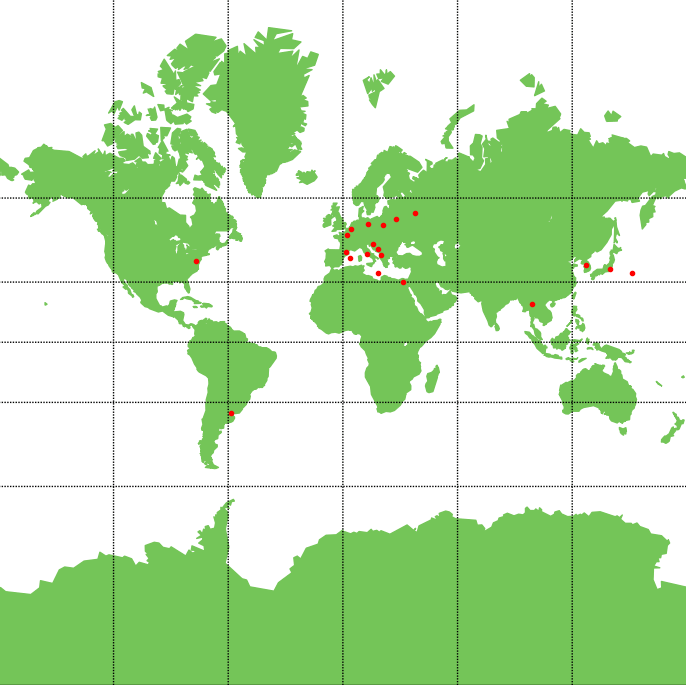

<h1 align="center">Analysis of Geoegraphic Coordinates</h1>

<p align="center">
  <a href="https://github.com/kamilkalarus">Kamil Kalarus</a>
</p>

## Opis


Aplikacja umożliwia wczytanie współrzędnych geograficznych z pliku CSV, 
co pozwala użytkownikom na łatwe dodawanie lokalizacji. Przed zapisaniem, 
dane te przechodzą dokładną weryfikację, aby zapewnić ich poprawność i spójność. Sprawdzane są m.in. format współrzędnych oraz zakres wartości geograficznych. Dopiero po pozytywnej weryfikacji, dane są przechowywane w bazie danych PostgreSQL, co zapewnia wydajność oraz skalowalność aplikacji.

Po pobraniu danych z bazy, aplikacja wizualizuje współrzędne na interaktywnej mapie świata. Punkty są łączone liniami w taki sposób, aby tworzyły zamknięte figury geometryczne, co umożliwia użytkownikom obserwację różnych kształtów i wzorów. Aplikacja wdraża algorytmy, które zapewniają, że linie nie przecinają się, co jest kluczowe dla estetyki i czytelności wizualizacji.


## Spis treści
- [Funkcjonalność](#funkcjonalność)
- [Demo](#demo)

## Functionality
- Wyznaczanie najbliższych punktów w zestawie danych.
- Tworzenie wizualizacji na mapie.
- Analiza i filtrowanie danych.


## Demo
Poniżej przedstawiono działanie algorytmu na 22 punktach lokalizacyjnych. Dwa punkty lokalizacyjne zostały scalone z powodu tych samych współrzednych geograficznych.



## Requirements
Aby zagwarantować poprawne działanie aplikacji należy spełnić niniejsze wymagania, aplikacja nie była testowana na innych konfiguracjach co może być potencialnym problemem z jej prawidłowym działanie. 

### System operacyjny:
- Windows 11 Home 23H2+
### Wersje oprogramowania:
- Python 3.12+
- PostgreSQL 16 
- pgAdmin 4 (opcjonalnie)
### Biblioteki Python:
- `pandas`, `numpy`, `matplotlib`, `basemap`, `basemap_data`, `psycopg2`, `tabulate`


## Setup

### Użycie gotowego pliku `.exe`


### Manualny (develop)

Aby zainstalowac wymagane biblioteki użyj jednego z poniższych poleceń:
- W konsoli języka Python:

  ```
  pip install -r requirements.txt 
  ```
- bądz w wierszu poleceń (cmd):

  ```
  python3 -m pip install -r requirements.txt
  ```


## Input data set
### Wymagania formatu danych
Aplikacja przyjmuje dane tylko w rozszerzeniu `.csv`. Dane wejściowe muszą być odpowiednio wstępnie sformatowane.
Każdy plik danych powinien zawierać dane jak w przykładzie poniżej, kolejność kolumn w pliku nie może ulec zmianie (w razie takiej potrzeby należy zmodyfikować klase `DataProcessor`)

Poniżej w tabeli zamieszczono szczegółowy opis każdej z kolumn:

|Kolumna|Opis|Uwagi|
|:--------:|:--------:|:--------:|
|point name|Nazwa punktu współrzędnych bądz nazwa własnna | Może zawierać tylko znaki alfabetu łacińskiego
|coordinates|Współrzędne geograficzne punktu |Akceptowalne są dane w formacie dziesiętnym, w stopnaich, w stopniach z minutami, oraz w stopniach z minutami i sekundami <sup>1</sup>|
|altitude|Wysokość punktu n.p.m| Wartość musi być wyrażona w kilometrach|
|metadata|Dodatkowe metadane| Nie są wymagane do prawidłowego działania<sup>2</sup>|

<sup>1</sup> w razie problemów z danymi można zmodyfikować regexy znajdujące się w `dataprocessor.checkAndConvertCoordinates()` bądz dostosować dane do wymaganego formatu. Wszystkie akceptowalne formaty znajdują się poniżej a ich działanie można sprawdzić na stronie [regex101: build, test, and debug regex](https://regex101.com/)

```python
^(-?\d{1,3}\.\d+),(-?\d{1,3}\.\d+)$
^([NS])(\d{1,3}\.\d+)°,([EW])(\d{1,3}\.\d+)°$
^([NS])(\d{1,3})°(\d{1,3}\.\d+),([EW])(\d{1,3})°(\d{1,3}\.\d+)$"
^([NS])(\d{1,3})°(\d{1,3})'(\d{1,3}\.\d+)\"\,([EW])(\d{1,3})°(\d{1,3})'(\d{1,3}\.\d+)\"$
```
<sup>2</sup> jeśli metadane będą wymagały weryfikacji należy zmodyfikować metode `dataprocessor.checkMetadata()` uzupełniając ją o własną metode weryfikacji (domyślnie nieużywana)

### Przykładowa zawartość pliku CSV:
```csv
point name;coordinates;altitude;data and time;metadata
Tokyo;N35°40'58.220",E139°45'34.038";0.044;15.06.2024 08:20;
```


## Usage/Examples

```javascript
import Component from 'my-project'

function App() {
  return <Component />
}
```

## Documentation

[Documentation]()
